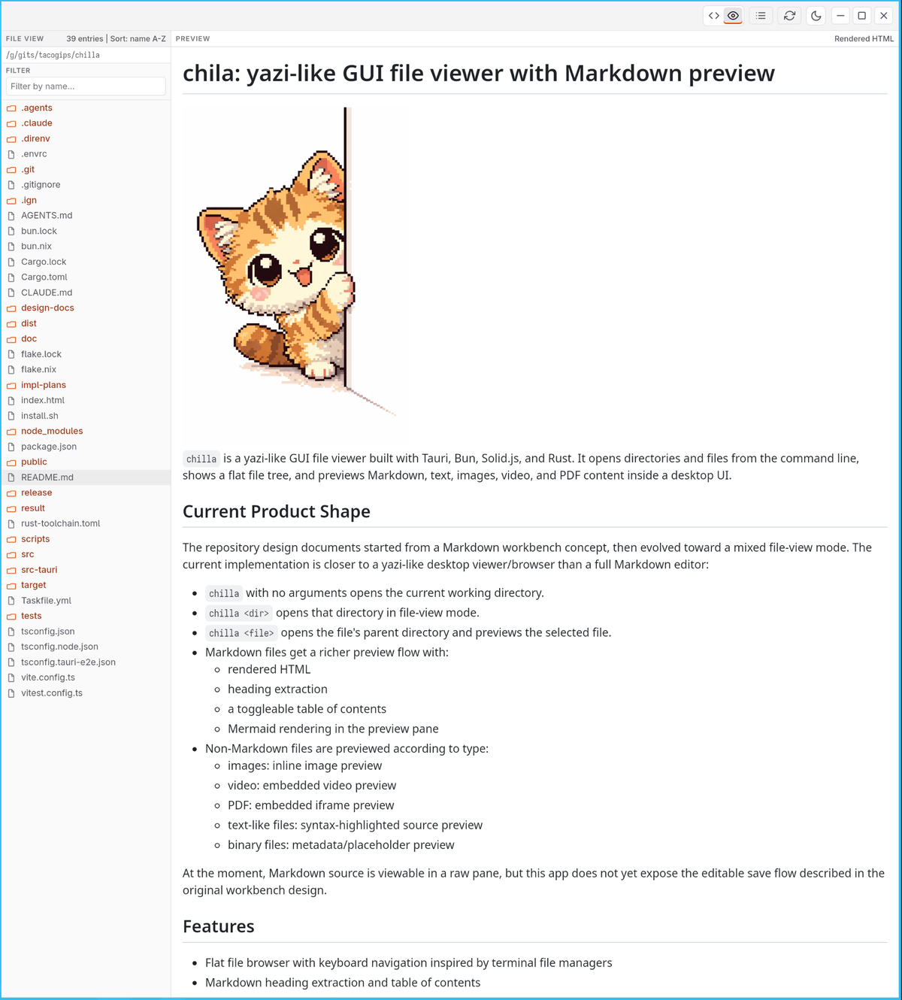
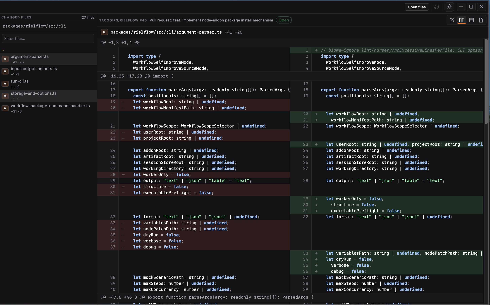
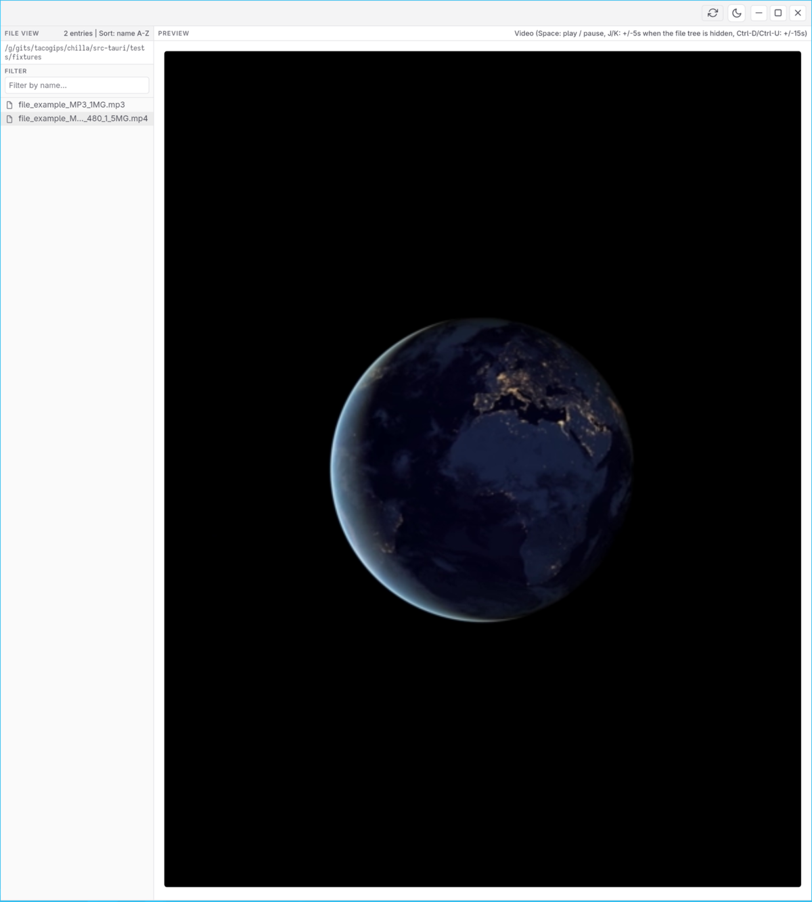

# chilla: lightweight file and Git viewer


`chilla` is a lightweight file and Git viewer built with Tauri, Bun, Solid.js, and Rust. It opens directories, files, Git diffs, and GitHub diff URLs from the command line, then previews Markdown, text, images, video, PDF content, and changed files inside a desktop UI.

## Install

### macOS: Homebrew Cask

```bash
brew tap tacogips/tap
brew install --cask chilla
```

This installs the signed and notarized macOS application bundle through Homebrew. After installation, launch it from `Applications` or from the command line:

```bash
open -a chilla
chilla .
```

To upgrade later:

```bash
brew update
brew upgrade --cask chilla
```

To uninstall:

```bash
brew uninstall --cask chilla
```

Current Homebrew caveats:

- the cask installs the macOS Apple Silicon DMG release artifact
- it is currently constrained to Apple Silicon via Homebrew `depends_on arch: :arm64`
- Homebrew trust comes from the published signed and notarized DMG

### macOS: Direct DMG Download

For Apple Silicon Macs, download the signed and notarized DMG directly from the latest GitHub release:

```text
https://github.com/tacogips/chilla/releases/latest
```

Manual install steps:

1. Open the latest release page.
2. Download the Apple Silicon DMG asset named like `chilla_<version>_aarch64.dmg`.
3. Open the downloaded `.dmg` file.
4. Drag `chilla.app` into `Applications`.
5. Eject the mounted DMG.
6. Launch `chilla` from `Applications`, or run `open -a chilla` from Terminal.

If macOS Gatekeeper asks for confirmation on first launch, open the app from Finder with `Control` + click, choose `Open`, then confirm. The published DMG is signed and notarized; that prompt is the normal first-launch confirmation path when opening newly downloaded apps.

Use the direct DMG route when you do not use Homebrew, or when you want to manually download a specific release asset.

### Install Script

The repository also includes a root-level `install.sh` for installing release tarballs:

```bash
curl -fsSL https://raw.githubusercontent.com/tacogips/chilla/main/install.sh | bash
```

Specific version:

```bash
curl -fsSL https://raw.githubusercontent.com/tacogips/chilla/main/install.sh | bash -s -- v0.1.1
```

Uninstall:

```bash
curl -fsSL https://raw.githubusercontent.com/tacogips/chilla/main/install.sh | bash -s -- uninstall
```

Installer behavior:

- resolves the current platform as one of `aarch64-darwin`, `x86_64-darwin`, `aarch64-linux`, or `x86_64-linux`
- prefers a matching archive in a local `release/` directory when present
- otherwise downloads the latest GitHub release asset named `chilla-v<version>-<target>.tar.gz`
- installs the extracted release tree under `~/.local/share/chilla/releases/`
- updates `~/.local/bin/chilla` to point at the installed wrapper
- can update the user's shell profile with a managed PATH block unless `--no-modify-path` is used
- supports `./install.sh uninstall` to remove the installed files and managed PATH block

The current installer-facing Darwin tarball remains a Nix-based release artifact containing `bin/chilla`, not a `.app` bundle. It may still depend on `/nix/store` runtime paths on the target machine.

For most macOS users, prefer the Homebrew Cask or direct DMG install paths above.

## Run

From an installed binary, the CLI shape is:

```bash
chilla [path]
```

Examples:

```bash
chilla
chilla .
chilla docs/
chilla notes.md
chilla movie.mp4
```

During development:

```bash
mise run dev
```

The development task accepts paths in the same style:

```bash
mise run dev --
mise run dev -- README.md
```

## Captures

README preview:



Git diff viewer:



Movie preview:



## Current Product Shape

The repository design documents started from a Markdown workbench concept, then evolved toward a lightweight file and Git viewer. The current implementation is closer to a yazi-like desktop viewer/browser than a full Markdown editor:

- `chilla` with no arguments opens the current working directory.
- `chilla <dir>` opens that directory in file-view mode.
- `chilla <file>` opens the file's parent directory and previews the selected file.
- Markdown files get a richer preview flow with:
  - rendered HTML
  - heading extraction
  - a toggleable table of contents
  - Mermaid rendering in the preview pane
  - local image links, including HEIC / HEIF assets when the platform WebView can decode them
- Non-Markdown files are previewed according to type:
  - images: inline image preview, including HEIC / HEIF when the platform WebView can decode the file
  - video: embedded video preview
  - PDF: embedded iframe preview
  - text-like files: syntax-highlighted source preview
  - binary files: metadata/placeholder preview

Markdown source can be edited in the raw pane and saved back to disk. If the file changes on disk while the editor has unsaved changes, chilla keeps the local buffer and surfaces a conflict flow instead of silently overwriting it.

## Features

- Flat file browser with keyboard navigation inspired by terminal file managers, including a filter-row toggle for Git-ignored entries, compact absolute-path display with full-path hover text, a `Tab` directory-information tree, dedicated symbolic-link icons, and visible resolved link destinations
- Markdown heading extraction and table of contents
- Direct Markdown view selection with `1` for raw source and `2` for rendered preview
- Backend-owned Markdown parsing in Rust
- Mermaid hydration on the frontend after preview render
- Active preview headers show the selected file name across Markdown, text, image, CSV, EPUB, PDF, audio, and video views
- Local Markdown image resolution with HEIC / HEIF image fallback and open-in-default-app affordance when the WebView cannot render an image
- Direct image-file previews for AVIF, APNG, BMP/DIB, GIF, HEIC/HEIF, ICO, JPEG, PNG, SVG, TIFF, and WebP files that the platform WebView can decode
- Touch-style left-button drag panning for direct SVG and raster image previews
- GitHub diff URL viewer for pull requests, commits, and compares with changed-file browsing, GitHub jump action, cached diff loading, text modes for left/right, stack, and full-file review, plus rendered SVG image review
- Local Git diff viewer for uncommitted repository changes and commit/range startup diffs using the same review modes
- Automatic refresh of opened Markdown documents when the file changes on disk, including common atomic-replace save patterns
- Revision-aware workspace refresh that re-reads the current directory or explicit file set and active local preview, including image and PDF cache invalidation
- Direct CSV view selection with `1` for raw source and `2` for formatted table when available
- Theme toggle with frontend CSS variables and backend syntax-theme synchronization
- Custom undecorated desktop window chrome

## Keyboard Shortcuts

Global shortcuts:

- `?`: show help
- `Esc`: close help
- `Q`: quit the app
- `Ctrl+D`: page the active file view down; in Git diff mode, page the selected diff file view rather than the changed-file sidebar
- `Ctrl+U`: page the active file view up; in Git diff mode, page the selected diff file view rather than the changed-file sidebar
- `J` or `ArrowDown`: scroll the active file view down one line when the file tree is hidden
- `K` or `ArrowUp`: scroll the active file view up one line when the file tree is hidden
- `Shift+L`: toggle file tree
- `G`: toggle local Git diff for the opened repository
- `Y`: copy the selected file or directory absolute path
- `R`: refresh the current directory or explicit file set and active local file
- `Shift+T`: toggle table of contents for Markdown
- `Shift+P`: switch Markdown raw/preview pane
- `1`: select raw view for Markdown or CSV
- `2`: select Markdown preview or formatted CSV view when available
- `+` / `-`: zoom rendered Markdown and other rendered content from 50%-300%, or direct SVG and raster image previews from 50%-800%, in 10% steps
- `Ctrl+mouse wheel`: zoom the rendered preview under the pointer
- `Shift+S`: toggle light/dark theme

File tree shortcuts:

- `/`: focus filter
- `.`: toggle Git-ignored entries in directory browsing
- `Tab`: show the current directory's absolute path and metadata as a root-to-leaf tree
- `Esc`: close directory information, or clear the filter and return to the list when the filter is focused
- `J` or `ArrowDown`: move selection down
- `K` or `ArrowUp`: move selection up
- `0`: reset sort to default (`name` ascending)
- `a`: sort by name ascending
- `A`: sort by name descending
- `e`: sort by extension ascending
- `E`: sort by extension descending
- `m`: sort by modified time ascending
- `M`: sort by modified time descending
- `s`: sort by size ascending
- `S`: sort by size descending
- `H` or `ArrowLeft`: go to parent directory
- `L`, `ArrowRight`, `Enter`: open or confirm selection
- `Ctrl+M`: same as `Enter` in the filter field

Video preview:

- Opening a video from the file tree requests playback immediately when the webview allows it.
- The preview overlay uses a focused play button with an icon-only affordance and an accessible label for the current file.
- `Space`: play/pause when supported by the platform/webview

Image preview:

- Markdown image links resolve local image paths relative to the Markdown document, including `.heic`, `.heif`, `.heics`, and `.heifs` files.
- Direct file previews classify AVIF, APNG, BMP/DIB, GIF, HEIC/HEIF, ICO, JPEG (`.jpg`, `.jpeg`, `.jpe`, `.jfif`), PNG, SVG, TIFF, and WebP files as images instead of generic binary or text files.
- Display support depends on the platform WebView decoder; when an image cannot render, chilla shows a fallback with an option to open the file in the default app.

CSV preview:

- `1`: raw CSV source
- `2`: formatted CSV table when parsing and safety limits allow it
- Numeric CSV view shortcuts are ignored while typing in editable controls such as the file filter.

Diff viewer:

- Pass a GitHub diff URL to open read-only GitHub diff mode:
  - `https://github.com/<owner>/<repo>/pull/<number>`
  - `https://github.com/<owner>/<repo>/pull/<number>/files`
  - `https://github.com/<owner>/<repo>/commit/<sha>`
  - `https://github.com/<owner>/<repo>/compare/<base>...<head>`
- Add `--no-github-diff-cache` before the URL to bypass the temp-directory cache. The older `--no-pr-diff-cache` flag remains available as a compatibility alias.
- Open a directory inside a Git repository and use `Git diff` to switch to uncommitted-change diff mode.
- Start commit/range diff mode with:
  - `chilla <git-dir> <commit>`
  - `chilla <git-dir> <base>..<head>`
  - `chilla <git-dir> <base>...<head>`
- `1`: left/right diff
- `2`: stack diff
- `3`: full-file view
- `4`: rendered image view for SVG files
- `Tab`: cycle diff modes in the same order, including image view for SVG files
- `Ctrl+D`: page the selected diff file view down
- `Ctrl+U`: page the selected diff file view up
- `O`: open the pull request, commit, or compare source in GitHub when reviewing a GitHub diff
- Full-file view shows the latest file content, highlights added and modified lines, and marks deleted locations with a thin red line without rendering deleted content.
- SVG image view renders the latest complete SVG in an isolated image without replacing the existing XML/text review modes.

## Architecture

The app is split across a typed Tauri boundary:

- `src-tauri/`
  - CLI parsing and startup target resolution
  - directory listing and file classification
  - Markdown rendering and heading extraction
  - syntax highlighting
  - filesystem watching for Markdown refresh
- `src/`
  - workspace shell and desktop UI
  - file browser interactions
  - preview panes for Markdown, image, text, PDF, and video
  - theme management
  - Mermaid enhancement after HTML injection

Key runtime contracts:

- `StartupContext`: initial workspace mode, directory, and selected file
- `DirectorySnapshot`: current directory listing
- `DocumentSnapshot`: Markdown source, rendered HTML, headings, and revision metadata
- `FilePreview`: typed preview union for Markdown, image, video, PDF, text, and binary files

## Project Layout

```text
.
├── src/                 # Solid.js frontend
├── src-tauri/           # Rust + Tauri backend
├── design-docs/         # design notes and specs
├── impl-plans/          # implementation plans
├── mise.toml         # common development commands
├── package.json         # Bun scripts
└── flake.nix            # Nix development environment
```

## Development

### Prerequisites

- Nix with flakes enabled
- direnv optional but recommended

The repository is set up for `mise install`, which provides Bun, Cargo, Tauri-related build dependencies, and the Rust toolchain.

### Enter the dev shell

```bash
mise install
```

### Common commands

```bash
mise run dev
mise run build
mise run nix-build
mise run test
mise run test-tauri-e2e-linux
mise run check
mise run clippy
mise run fmt
```

Equivalent package-manager commands:

```bash
bun run dev
bun run build
bun run typecheck
bun run test
bun run test:tauri:e2e:linux
CARGO_TERM_QUIET=true cargo test --manifest-path src-tauri/Cargo.toml
```

`mise run build` compiles the Tauri backend with Cargo `--release`.
`mise run tauri-build` creates the packaged desktop binary with Tauri's release build.

### Linux desktop E2E

The repository also includes a Linux-only desktop smoke test that runs the real Tauri app through `tauri-driver`:

```bash
CARGO_TERM_QUIET=true cargo install tauri-driver --locked
bun run test:tauri:e2e:linux
```

Notes:

- `WebKitWebDriver` is expected on `PATH`. The mise environment provides it via `webkitgtk_4_1`.
- If `DISPLAY` is not set, the runner falls back to `Xvfb` when available.
- The smoke test opens the real workspace, filters to `README.md`, and verifies the rendered Markdown preview.

## macOS DMG Releases

The repository now also contains a separate Tauri macOS bundle flow for direct `.app` and `.dmg` builds:

```bash
mise run bundle-macos-dmg
```

That path uses `src-tauri/tauri.macos.release.conf.json` and is intended for Apple Developer ID signing/notarization on a local macOS release machine. Apple certificate material should stay in the local keychain and password manager, not in GitHub Actions secrets.

The local release task expects these environment variables to be exported by the local password-manager workflow:

- `APPLE_SIGNING_IDENTITY`
- `APPLE_ID`
- `APPLE_PASSWORD` (an Apple app-specific password)
- `APPLE_TEAM_ID`

Publish signed/notarized macOS release assets from the local machine with:

```bash
mise run release-macos-dmg-local -- v0.1.18
```

Repository-local GitHub Actions build unsigned `.app`/`.dmg` artifacts only for validation. They do not sign, notarize, or publish trusted release assets.

## Verification Status

The following commands were confirmed passing while preparing this README:

- `bun run typecheck`
- `bun run test`
- `CARGO_TERM_QUIET=true cargo test --manifest-path src-tauri/Cargo.toml`

## Design Notes

The design docs under `design-docs/specs/` still reflect two overlapping phases of the product:

- the original Markdown workbench design
- the later file-view mode extension

The implementation has already adopted file-view startup and multi-type preview behavior, so the source code is the more accurate reference for current behavior. The active implementation plans should be read as planning artifacts, not as a precise status dashboard.
